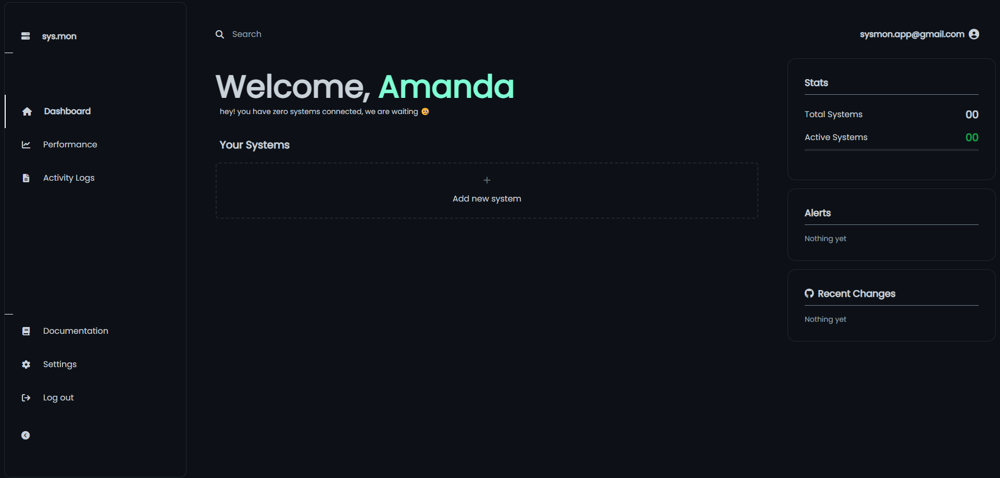

# Project sys.mon

sys.mon is a ReactJS - Flask (Python) application that monitors performance of remote servers from a ReactJS dashboard using Flask API and web sockets.

Run the app is in production here,
open [https://sys-mon.pages.dev/](https://sys-mon.pages.dev/) to view it in your browser.

**Supporting Repositories**
* Backend - https://github.com/ishwarjagdale/sys.mon-server
* Installer/Scripts - https://github.com/ishwarjagdale/sys.mon-scripts

**Technologies & Libraries used**
* Python - Flask (backend)
* ReactJS
* TailwindCSS
* ChartJS
* React Router v6

**Environment**

Set following environment variables to run

	`REACT_APP_API_URL=http://localhost:5000/`

## How to use

**1. Create an account** [here](https://sys-mon.pages.dev/get-started)

1. Enter your **name**, a **valid email** and a **password** of length longer than 6.
2. Then you will receive a link on entered email address, use it to **authenticate** account which is required to 		access the dashboard

**2. Download the scripts**

1. Click on `+ Add new System` button in the dashboard to download the scripts or clone the [`sys.mon scripts`](https://github.com/ishwarjagdale/sys.mon-scripts) repository
2. Run the `main.py` python script. Use arguments `init` to register system, `register` and `login` as respective features (*install the packages given in requirements.txt*).
3. Log in using the credentials of newly created account and follow further given instructions.
4. Run `mon.py` as systemd service on linux or add it to Task Scheduler on Windows to start it on boot after configuring network.
5. When running `mon.py` pass an **open port** number as an argument, for eg. `mon.py 80`. An open port is required for websocket server to use and application to be able to connect to mon.
*if port number is not passed the script will randomly choose a port, so make sure to open that port and allow the script to communicate through firewall. The websocket server uses wss:// protocol to communicate with the server and dashboard.*

**3. Done!**
Refresh the dashboard to see newly installed systems. 
You can add rules on the system by clicking on the name of the system's name in dashboard 
i.e., when a system crosses the value defined in the rule you will get an email.

